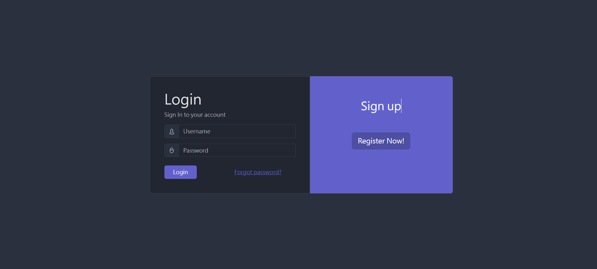
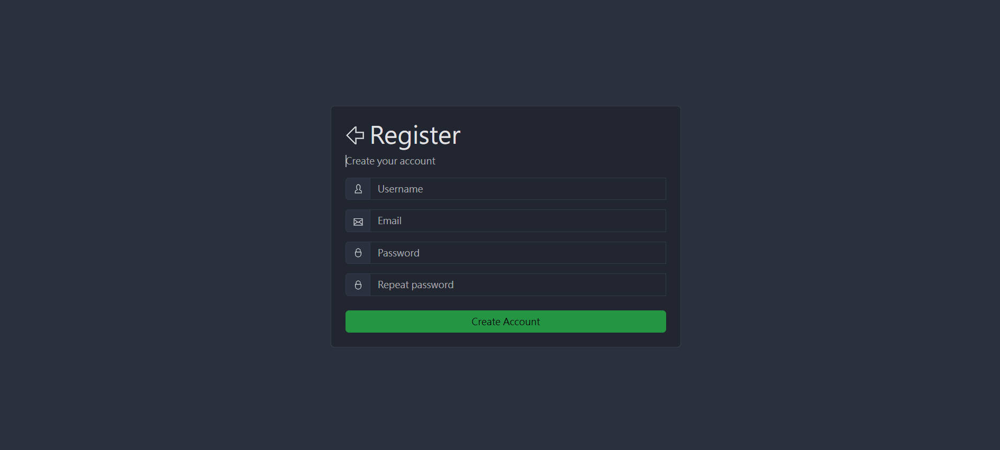
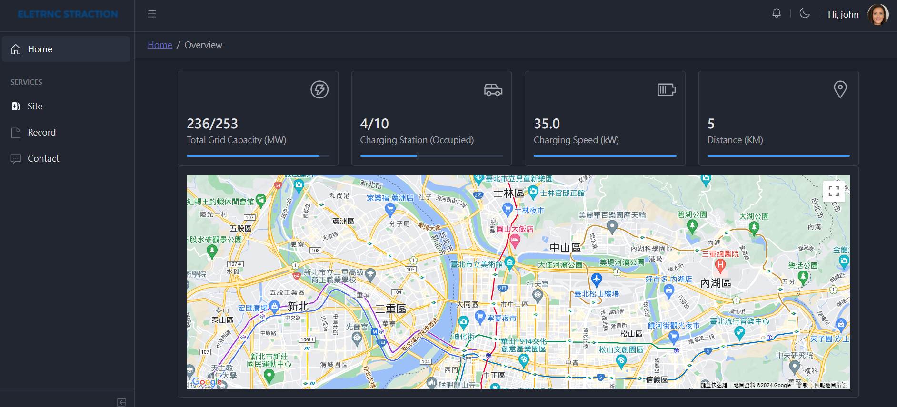
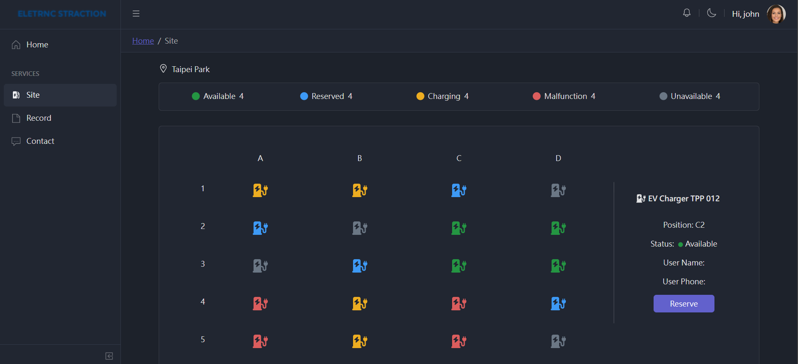
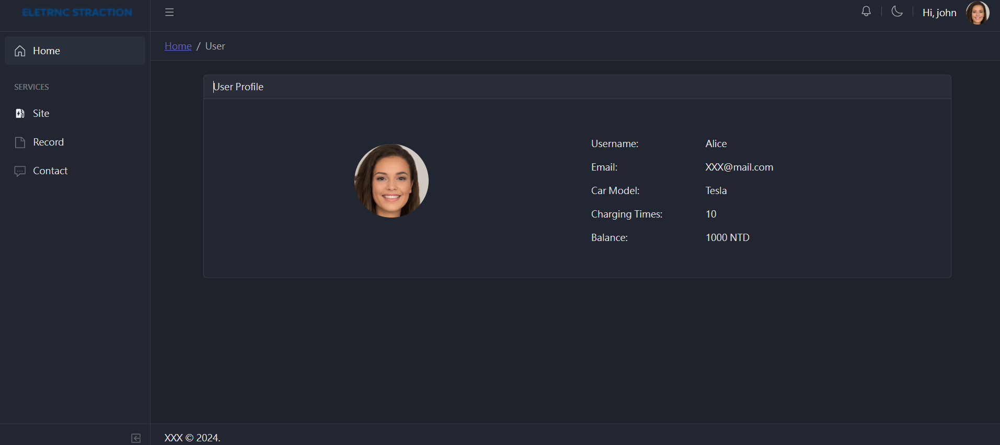
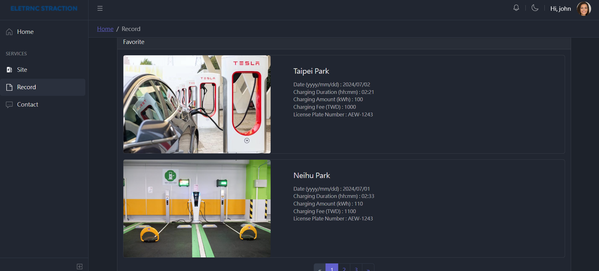
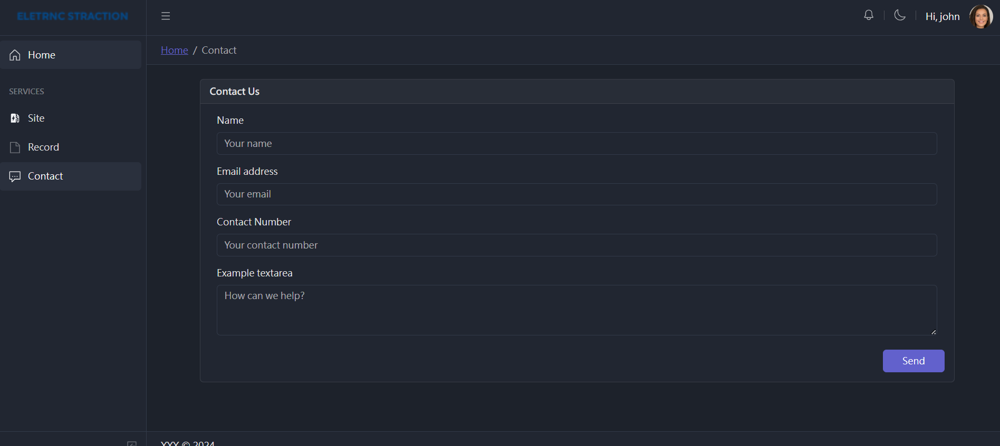

# React Admin Template

### Preview









### Installation

```bash
$ npm install
```

or

```bash
$ yarn install
```

### Basic usage

```bash
# dev server with hot reload at http://localhost:3005
$ npm start
```

or

```bash
# dev server with hot reload at http://localhost:3005
$ yarn start
```

Navigate to [http://localhost:3005](http://localhost:3005). The app will automatically reload if you change any of the source files.

#### Build

Run `build` to build the project. The build artifacts will be stored in the `build/` directory.

```bash
# build for production with minification
$ npm run build
```

or

```bash
# build for production with minification
$ yarn build
```

## What's included

```

├── public/          # static files
│   ├── favicon.ico
│   └── manifest.json
│
├── src/             # project root
│   ├── assets/      # images, icons, etc.
│   ├── components/  # common components - header, footer, sidebar, etc.
│   ├── layouts/     # layout containers
│   ├── scss/        # scss styles
│   ├── views/       # application views
│   ├── _nav.js      # sidebar navigation config
│   ├── App.js
│   ├── index.js
│   ├── routes.js    # routes config
│   └── store.js     # template state example
│
├── index.html       # html template
├── ...
├── package.json
├── ...
└── vite.config.mjs  # vite config
```
